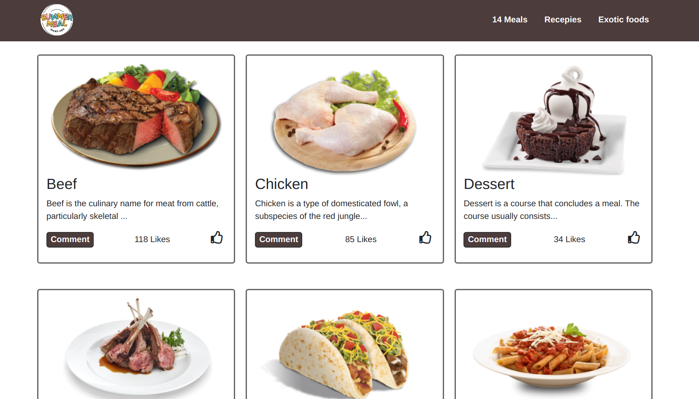

# RestorauntApi

> This is a restaurant application for my JavaScript capstone project. It showcases different foods that can be liked and commented on. It uses an API to store likes and comments. It was developed with HTML, CSS, and JavaScript.

## Built With

- Javascript
- Html
- Bootstrap
- Css
- Jest
- Fontawesome CDN

## LiveLink
[LiveLink](https://henrykc24.github.io/javascript-capstone-project/dist/)

### Video demo
[VideoLink](https://drive.google.com/file/d/1ybLtxSC8SSCKpcN_FPnQ1OX328fvCrCK/view?usp=sharing)

## Getting Started

### To get a local copy up and running follow these simple example steps.

Clone the repo with `git clone https://henrykc24.github.io/javascript-capstone-project.git`

Run `cd RestorauntApi` to navigate to the project folder

Run `npm install` from the command line

Run `npm start` to start the local server in the a browser

### Prerequisites

- Have `git` installed
- Have text editor installed
- Install a browser

## Authors

👤 **Igor Koloski**  

- GitHub: [@igorkol91](https://github.com/igorkol91)
- Twitter: [@Destro49536502](https://twitter.com/Destro49536502)
- LinkedIn: [Koloski Igor](https://www.linkedin.com/in/igor-koloski-a754aa208/)

👤 **Henry Kc**

- GitHub: [@githubhandle](https://github.com/henrykc24)
- Twitter: [@twitterhandle](https://twitter.com/henrykc24)
- LinkedIn: [LinkedIn](https://linkedin.com/in/henry-kc)

## 🤝 Contributing

Contributions, issues and feature requests are welcome!

Feel free to check the [issues page](https://henrykc24.github.io/javascript-capstone-project/issues).

## Show your support

Give a ⭐️ if you like this project!

## Acknowledgments
- A special thanks to Microverse for inspiring this project. We are indebted to you all at Microverse
- A special thanks goes to all our peers at Microverse for being there for us throughout the app building period.

## 📝 License

This project is [MIT](./LICENSE) licensed.
